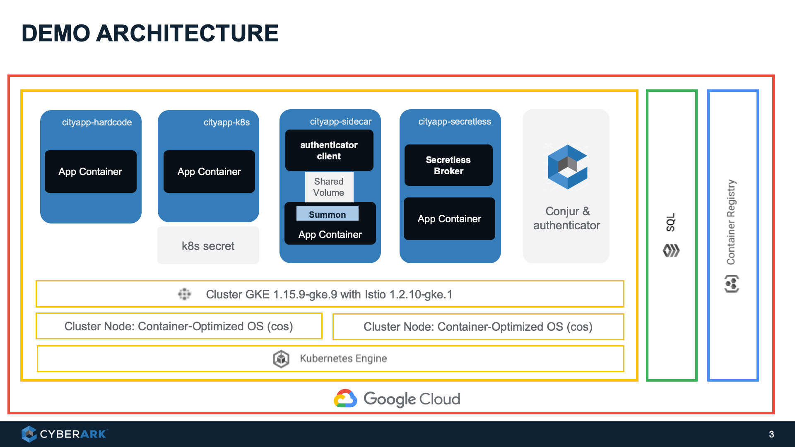

# Secretless Broker Demo on GKE

This repo contains scripts and files for deploying secretless broker demo on GKE with Istio enabled
```
Note: This repo contains sensitive info, like hardcoded passwords and IP, intentionally for demostration purpose. 
None of them are real and all of them do not work.
```

 

# Prepare the environment

## Build a k8s cluster
1. Login to cloud.google.com
2. Visit the Kubernetes Engine page in the Google Cloud Console.
3. Install `gcloud` & `kubectl` clients
4. Deploy GKE with Istio 
   https://cloud.google.com/istio/docs/istio-on-gke/installing#creating_a_cluster_with_istio_on_gke
5. Install Helm client 
   https://helm.sh/docs/using_helm/#installing-helm
6. Enable Helm on GKE

## Setup kubectl
gcloud container clusters get-credentials <cluster name> --region <region, e.g. asia-east2-c>
  
# Prepare App Images


## Cityapp Hard Code
In the `1-hardcode` folder, execute:
```
kubectl apply -f cityapp-hardcode.yaml -n cityapp
```

## Cityapp k8s secrets
In the `2-k8s-secrets` folder, execute:
```
kubectl create secret generic mysql01-secret --from-literal=password=conjur1234
kubectl apply -n cityapp  -f 2-k8s-secret/cityapp-k8s-secret.yaml
```

## 
